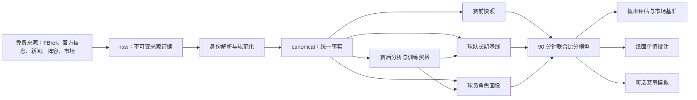

# 足球数据与预测平台 — 总体设计

- 状态：当前权威设计
- 日期：2026-07-16
- 产品短名：`football-data-platform`
- 当前实现仓库名：`football-data-platform`
- 历史仓库名：`world-cup-predictor`（兼容保留，不原地重命名）
- 仓库演进：[ADR-0020](../../adr/0020-product-name-and-repository-compatibility.md) 与 [ADR-0021](../../adr/0021-new-implementation-repository.md)
- 替代文档：[2026-05-28 世界杯预测系统设计](2026-05-28-world-cup-prediction-design.md)

## 1. 产品定位

本系统首先是足球数据采集、标准化、归档、分析和训练数据准备平台。它持续获取赛事与新闻信息，沉淀赛后球队和球员数据，构建可追溯的赛前快照、球队基线和球员角色画像，再向预测、纸面价值投注和赛事模拟等下游应用提供稳定数据。

核心链路为：

```text
免费数据来源
  → 不可变原始证据
  → 统一身份与规范事实
  → 赛前快照 / 球队基线 / 球员画像
  → 90 分钟联合比分分布
  → 评估、静态报告、纸面价值投注和可选赛事模拟
```

价值投注不是数据平台的拥有者。它是独立下游模块，只有在数据、模型和市场快照均通过准入后才运行。

## 2. 设计原则

1. **数据资产优先**：采集、身份、时间、血缘和完整性先于模型复杂度。
2. **时间诚实**：任何赛前训练或评估只能使用对应 `as_of` 之前可知的信息。
3. **证据优先**：新闻摘要、人工判断和模型调整必须能够追溯原始来源。
4. **单一概率口径**：胜平负、让球、总进球和比分概率来自同一联合比分分布。
5. **模块解耦**：采集、规范化、特征、模型、市场和报告通过版本化契约连接。
6. **任务级准入**：不同训练任务使用不同完整性资格，不能用一个全局 `ready` 掩盖缺失。
7. **真实市场验证**：模型只接受真实结果和真实市场基准检验，禁止合成赔率自证优势。
8. **零预算可观测运行**：免费来源允许缺失和中断，但失败必须可见、可补采、可重放。

## 3. 第一阶段范围

### 3.1 核心目标赛事

- 英格兰足球超级联赛（Premier League）
- 德国足球甲级联赛（Bundesliga）
- 西班牙足球甲级联赛（LaLiga）
- 意大利足球甲级联赛（Serie A）
- 法国足球甲级联赛（Ligue 1）

首批历史回填范围为 `2021-22` 赛季至今。

### 3.2 上下文赛事

平台还需要追踪核心球队和球员在以下赛事中的赛程、出场和负荷：

- UEFA Champions League
- UEFA Europa League
- UEFA Conference League
- 五大联赛球队参加的国内杯赛
- 五大联赛注册球员参加的国家队比赛

上下文赛事至少服务休息时间、赛程密度、伤停、近期状态和球员负荷。其高级统计深度可以低于核心目标赛事，但缺失必须显式标记。

### 3.3 第一阶段明确不做

- 滚球概率更新和滚球投注
- 自动连接博彩账户或真实资金下注
- 公开 Web 服务、移动端和对外 API
- 把整届赛事模拟作为核心验收条件
- 依赖付费体育数据 API

## 4. 系统边界与数据流



### 4.1 上游平台职责

- 来源注册、抓取和原始证据归档
- 赛事、球队、球员和比赛身份解析
- 新闻事实与赛前事件提取
- 赛前时间快照
- 赛后球队与球员数据归档
- 质量状态、训练资格和数据血缘
- 版本化训练数据集和模型输入

### 4.2 下游应用职责

- 核心比赛预测
- 静态数据与分析报告
- 纸面价值投注与模拟结算
- 可选的世界杯或联赛赛季模拟

下游失败不得阻断上游数据归档。

## 5. 数据来源策略

### 5.1 预算与访问边界

数据源月度预算为零。只使用允许访问的公开网页、免费 API、开放数据集和人工导入文件，并遵守来源的访问条款、频率限制和技术边界。验证码、登录限制或其他访问控制不属于正式采集方案。

### 5.2 FBref 的正式职责

FBref 是第一阶段主要比赛与球员统计源，也是比赛报告原始快照的主要归档来源。

现有能力可以复用：

- FBref HTML 与 `soccerdata.FBref` 获取路径
- 赛程和比赛报告解析
- `summary`、`passing`、`passing_types`、`defense`、`possession`、`misc`、`keeper` 表解析
- 原始 HTML、Parquet/CSV、诊断和离线重放基础

需要改造：

- 将世界杯硬编码发现流程改为“赛事注册表 × 赛季”编排
- 为五大联赛建立逐场、多赛季、可断点回填流程
- 增加球队级比赛统计和统一完整性配置
- 为原始快照增加 `observed_at`、校验和、采集器版本和版本清单
- 将 `soccerdata` 等真实依赖写入可复现环境

FBref 不承担新闻、伤停、停赛和官方首发的全部赛前信息。

### 5.3 其他免费来源

新闻、伤停、停赛、官方首发和市场赔率使用独立来源适配器。每类数据维护主要来源、备用来源、健康状态和冲突诊断。来源中断不能被解释为“事件不存在”。

当前执行补充见 [ADR-0022](../../adr/0022-football-data-results-fallback.md)：Football-Data
只作为赛程和 90 分钟赛果备用源，CSV 中赔率列不进入足球模型；FBref 仍是球队和球员统计主源。

## 6. 数据分层

### 6.1 `raw`

保存不可变来源证据：HTML、JSON、响应、人工导入文件、来源 ID、请求参数、抓取时间、目标事件时间、校验和和采集器版本。

### 6.2 `canonical`

保存使用平台实体 ID 的规范事实：赛事、赛季、球队、球员、比赛版本、赛程、阵容、事件、统计、新闻证据、结构化赛前事件和市场快照。

### 6.3 `derived`

保存可重建产物：赛前快照、球队长期基线、阵容增量、球员角色画像、训练数据集、模型产物、预测、评估、纸面账本和静态报告。

任何 derived 产物必须追溯输入数据版本、转换版本、生成时间和质量状态。模型与投注模块不得直接解析 raw 页面。

## 7. 统一身份模型

平台拥有稳定的：

- `competition_id`
- `season_id`
- `team_id`
- `player_id`
- `match_id`

外部来源 ID 通过来源映射表关联，映射记录来源、来源 ID、有效时间、匹配规则、置信度和审计信息。中英文名称、缩写和旧名只是别名，不是主键。

球员转会通过带时间范围的球队注册关系表达；比赛改期通过比赛版本表达。低置信度或冲突映射必须进入人工复核，人工 override 保留理由和证据。

## 8. 新闻与赛前事件

新闻分成三个层次：

1. **原始新闻证据**：标题、正文或快照、URL、来源、语言、发布时间和抓取时间。
2. **结构化赛前事件**：伤病、停赛、轮休、训练中断、旅途受阻或明确教练表态。
3. **模型调整**：事件影响的球队、球员、字段、幅度、理由和证据。

只有官方确认或多个独立来源交叉确认的事件可以修改模型特征。单一传闻、观点和自动摘要只能形成风险备注。外交、政治和舆情默认不直接修改概率，除非形成可验证的场内影响。

## 9. 比赛生命周期与赛前快照

每个比赛数据版本经过：

```text
discovered
  → t24-ready
  → lineups-ready
  → finished-stats-pending
  → archived-complete
  → training-ready（一个或多个任务资格）
```

状态只能由校验器计算，不能由文件存在或脚本手工指定。

### 9.1 标准赛前快照

- `T-24h`：按当时计划开赛时间提前 24 小时封存。
- `lineups-confirmed`：双方官方首发均公布后立即封存。

所有特征都必须满足 `known_at <= as_of`。

### 9.2 实采与重建

- `captured`：平台在赛前真实采集并记录可信 `observed_at`。
- `reconstructed`：赛后仅依据能够证明当时已知的历史事实重建。

两类样本分别报告。模型晋级主要依据前瞻 `captured` 样本；重建样本只能用于受限训练和研究。

## 10. 球员分析

球员分析采用位置与角色画像，不以跨位置单一综合分为核心。

画像至少覆盖：

- 出场时间、赛程密度和负荷
- 进攻与射门
- 创造与传球
- 推进与控球
- 防守
- 门将表现

指标需要带统计窗口、`as_of`、角色、样本分钟、`per 90`、同角色分位数和指标定义版本。长期能力、近期状态、当前可用性和负荷分别保存。缺失或不适用不等于零。

单一综合分只允许作为展示摘要，比赛模型消费底层版本化维度。

## 11. 球队实力与比赛上下文

五大联赛球队实力采用三层输入：

1. **球队长期基线**：来自对手强度和时间修正后的球队逐场过程数据。
2. **阵容增量**：预计或确认阵容相对于球队基线的变化。
3. **比赛上下文**：休息、赛程密度、伤停、停赛、场地、旅途和比赛目标。

三层共同形成双方进球期望。国家队等样本稀疏赛事可以提高球员先验权重，但必须使用单独模型或配置版本。

同一事实不得重复计价。例如球员缺阵已经通过确认阵容体现后，不能再次以人工攻击倍率下调。

## 12. 预测目标与比分模型

首要训练目标是：在明确赛前 `as_of` 时点，仅使用当时已知信息，预测 90 分钟及伤停补时结束时的主客队联合比分分布，不包含加时和点球。

胜平负、让球、总进球和准确比分概率必须由同一个归一化比分分布派生。

### 12.1 第一版基准

第一版正式基准是 Dixon-Coles 低比分校正的独立泊松比分模型。它不是经典共享潜变量意义上的“双变量泊松”，`rho` 是低比分依赖校正参数，不是普通全局相关系数。

若主队进球期望为 `lambda`、客队为 `mu`，低比分校正需按正式数学定义实现并测试：

```text
tau(0,0) = 1 - lambda * mu * rho
tau(0,1) = 1 + lambda * rho
tau(1,0) = 1 + mu * rho
tau(1,1) = 1 - rho
```

所有盘口使用同一 `lambda`、`mu`、`rho`、截断范围和归一化比分网格。当前代码中 `1-0` 与 `0-1` 的 lambda 使用需要按该定义审计和修正。

### 12.2 正式模型与挑战者

XGBoost 不再是必选修正层。任何统计或机器学习模型先作为挑战者影子运行，只有在按时间滚动的样本外验证中稳定改善 Brier、LogLoss、可靠性和关键分组表现后，才能晋级。

每个模型版本保存训练数据、特征、参数、评估区间、快照类型和可回滚产物。

## 13. 训练资格

`training-ready` 是资格集合，至少包括：

- `score-model-ready`
- `team-baseline-ready`
- `player-profile-ready`

比分模型需要合规赛前快照和 90 分钟标签；球队基线需要结果和规定球队过程数据；球员画像需要实际阵容、球员身份、分钟或角色以及规定球员统计。

每项资格拥有独立、带版本的字段和质量规则。同一场比赛可以只通过部分资格。不得为通过校验而静默填零或使用事后信息。

## 14. 市场数据与价值投注

核心足球模型不使用赔率作为输入。市场赔率独立保存来源、盘口、选项、赔率、状态和 `observed_at`。

必须区分：

- 含水隐含概率：`1 / odds`
- 去水市场概率
- 模型与去水市场分歧
- 模型与当前报价的价格概率差
- 单位本金期望净收益（EV）

价值投注模块在预测之后组合模型、市场和风险配置。市场数据缺失不阻断足球预测，但会阻断正式市场评估和投注候选。

第一阶段仅运行纸面投注：保存当时预测、真实报价、风险规则、建议仓位、赛果和真实结算规则，不连接账户或自动下注。

同场多盘口的总投注额和方向集中风险必须受控。标量逐注 Kelly 不能被描述为已经处理同场相关性的投资组合 Kelly。

## 15. 评估与模型治理

唯一有效的模型判断来自真实比赛结果与真实市场快照：

- Brier Score
- LogLoss
- 可靠性曲线与校准分组
- 对同一结果的去水市场基准
- 按联赛、主客、概率区间、快照类型和数据完整性分组诊断

禁止：

- 用模型概率加噪声生成赔率
- 用训练集或存在时间穿越的随机切分晋级模型
- 用命中率或短期纸面 ROI 替代概率评分
- 混合 `captured` 与 `reconstructed` 样本却不分别展示

挑战者晋级所需最小样本、观察周期和置信区间方法在评估规范中另行确定。样本不足时只允许影子运行。

## 16. 本地运行与交付

第一阶段通过可重复执行的本地命令行任务完成：

1. 注册赛事和赛季
2. 发现赛程并分配平台身份
3. 采集 raw 来源快照
4. 规范化 canonical 事实
5. 生成 `T-24h` 和 `lineups-confirmed` 快照
6. 完赛后增量补采球队与球员数据
7. 计算生命周期和训练资格
8. 构建版本化训练数据集与特征
9. 运行正式模型和挑战者
10. 生成评估、球员分析和纸面价值投注报告

任务应幂等、可断点重跑，并输出运行清单、版本、诊断和明确退出码。notebook 只用于研究，不是正式每日入口。结构化数据是事实来源，HTML/Markdown 是可重建展示层。

## 17. 实施顺序

### 17.1 首个纵向切片

先用 `2025-26` 英超跑通完整链路：

- 赛事注册和完整赛程
- FBref 逐场原始归档与诊断
- 统一球队、球员和比赛身份
- canonical 球队与球员事实
- 新闻证据和结构化事件
- 两类赛前快照及 capture mode
- 赛后生命周期和三种训练资格
- 球队基线、球员角色画像和静态报告
- 比分模型样本与真实评估清单

纵向切片通过后，以赛事注册和配置扩展到其他五大联赛、历史赛季和上下文赛事。不得复制五套联赛脚本。

### 17.2 第一阶段完成标准

第一阶段至少需要证明：

- 五大联赛 `2021-22` 至今的赛事、赛季、球队和比赛身份可追溯
- 免费来源失败和字段缺失有机器可读诊断与补采状态
- 新比赛能真实封存两类赛前快照
- 赛后数据可以从 pending 推进到明确完整性配置
- 三种训练资格能够独立计算并解释排除原因
- 训练数据集无时间穿越且保存完整清单
- 基准模型、挑战者和真实市场基准使用一致样本评估
- 纸面投注账本可按真实赔率与结算规则复现
- 静态报告引用明确数据、特征、模型和市场版本

具体覆盖率、失败率和模型晋级数值阈值在相应执行规范中确定，不能在没有真实采集基线前虚构。

## 18. 当前仓库迁移重点

### 18.1 优先复用

- `src/data/fbref_scraper.py` 的表格解析、原始快照和诊断基础
- `src/models/score_grid.py` 的统一比分网格方向
- 场外 context 的来源与理由审计思想
- 现有市场结算、去水、Kelly 和同场过滤逻辑中已经验证的部分
- 世界杯归档数据作为迁移与解析回归样本

### 18.2 必须重构或修复

- 把世界杯特化数据提供器改为通用赛事注册与适配器
- 把采集、预测、市场选择、日志和 HTML 渲染从一体化每日脚本拆开
- 用统一平台实体 ID 替换散落的名称和来源 ID 关联
- 统一预测日志、结算和市场基准评估 schema，恢复前瞻评估闭环
- 让 `MatchPredictor` 与 `score_grid` 共享唯一比分网格和可传入的场地倍率
- 按正式 Dixon-Coles tau 定义修复并测试低比分格
- 将 `soccerdata` 等真实运行依赖写入环境配置
- 将旧 notebook 和实时投注文档标记为研究或遗留入口

### 18.3 历史兼容

现有数据、报告和旧设计不删除。迁移通过版本和适配器逐步进行，历史产物保留其生成时的旧口径，不伪装为新数据契约。

## 19. 仍需后续执行规范确定的事项

- 免费来源注册表、轮询频率、超时和失败通知
- raw/canonical/derived 的最终目录、分区和本地目录技术
- 各训练资格的完整字段清单
- 球员角色体系、指标和最小分钟数
- 球队基线窗口、时间衰减和对手强度修正
- 模型晋级的最小前瞻样本、观察周期和统计门槛
- 正式市场来源、盘口范围、去水方法和纸面风险配置
- 原始和派生数据的长期保留与压缩策略

这些是执行层决策，不改变本文已经确定的产品边界和领域架构。
